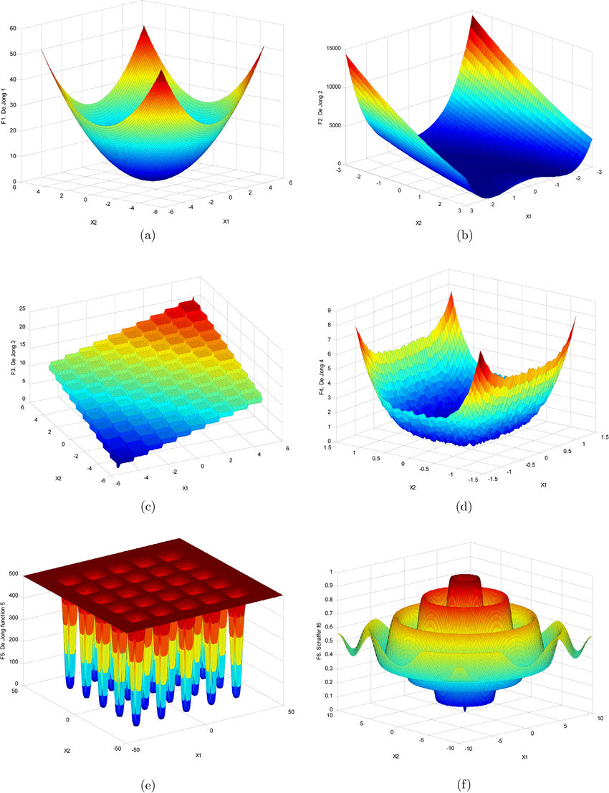

# Genetic-Algorithms
 Genetic Algorithm to find minima in Dejong Functions

 * ***Please look at the pdf for an insightful explaination with plots. The same goes for the notebook.***

 In this project I use a Genetic Algorithm (GA) to find minima in Dejong Functions:

 